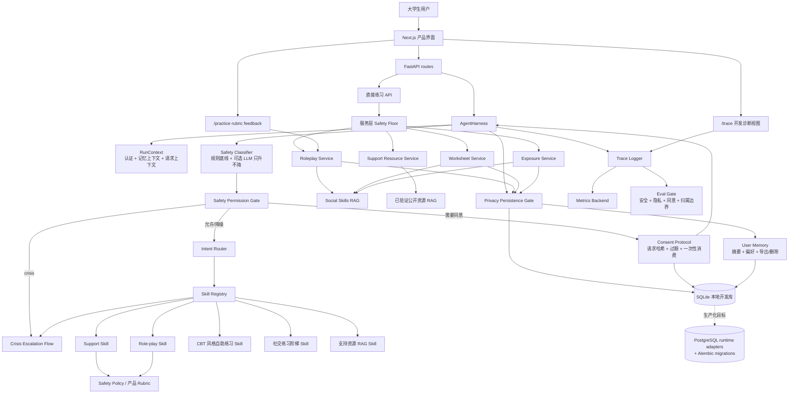

# SocialEase 架构图

这份图用于说明 SocialEase Agent 的系统边界和运行链路。项目定位是安全可控的 agent harness 产品化原型，而不是单轮聊天 prompt。

## 讲解口径

- 前端是产品体验入口；真正的安全边界放在后端 harness、permission gate 和服务层 safety floor。
- LLM 是可选增强，不是系统唯一依赖；关闭 API key 时仍可用 deterministic fallback 跑完整流程。
- Crisis 输入绕过普通 agent，进入危机转介流程。
- 会改变用户状态的主动练习必须经过权限判断和 consent protocol。
- Role-play feedback 使用隐私安全的派生特征和 rubric，不把长期原始对话作为记忆基础。
- SQLite 用于本地开发和展示；PostgreSQL adapter、Alembic、迁移检查和 repository factory 是生产化路径。
- Trace、metrics 和 eval gate 让安全、隐私、同意和多用户边界可观察、可回归。
