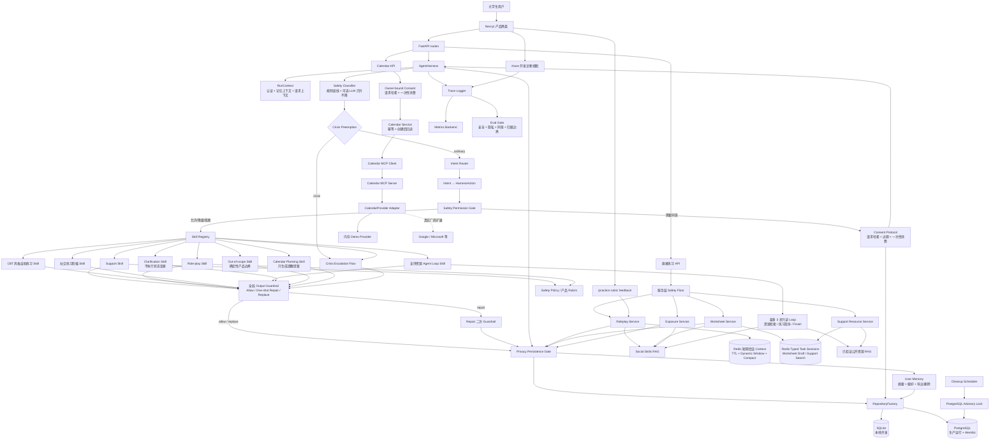

# SocialEase 架构图

这份图用于说明 SocialEase Agent 的系统边界和运行链路。项目定位是安全可控的 agent harness 产品化原型，而不是单轮聊天 prompt。

## 讲解口径

- 前端是产品体验入口；真正的安全边界放在后端 harness、permission gate 和服务层 safety floor。
- LLM 是可选增强，不是系统唯一依赖；关闭 API key 时仍可用 deterministic fallback 跑完整流程。
- Crisis 输入绕过普通 agent，进入危机转介流程。
- 信息不足时先澄清，明确领域外请求返回产品边界；这两个分支不创建练习计划。
- 会改变用户状态的主动练习必须经过权限判断和 consent protocol。
- Role-play feedback 使用隐私安全的派生特征和 rubric；Redis 只在 TTL 内保存受 Token Budget 约束的任务上下文，不把原始对话提升为长期记忆。
- Worksheet 使用结构化草稿和少量补充回答，Support 使用查询与 Citation 指代状态；Progress 继续使用 Plan/Task/Attempt，不复制聊天窗口。
- Calendar Skill 只生成提案；创建、修改和删除由独立 API 在 Consent 后通过 MCP 完成，当前 Provider 是 Demo，真实厂商需要单独实现 OAuth 和 Adapter。
- SQLite 用于本地开发和展示；RepositoryFactory 在生产运行时选择 PostgreSQL，并由 Alembic 和集成测试验证迁移与主要 Repository 路径。
- 全局 Output Guardrail 位于 Skill 之后、Memory/Trace/API 返回之前；Repair 最多一次，并对同一修复文本再次检查。
- PostgreSQL cleanup scheduler 使用 advisory lock，避免多个副本重复执行同一轮清理。
- Trace、metrics 和 eval gate 让安全、隐私、同意和多用户边界可观察、可回归。
