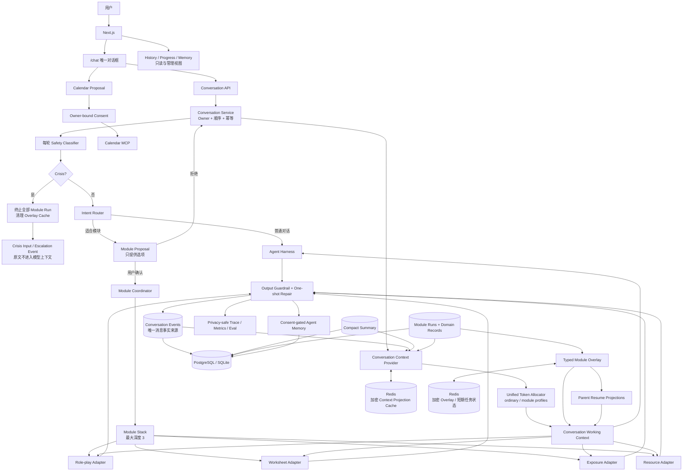

# SocialEase 架构图

SocialEase 的产品主线是一个用户拥有的 Conversation，而不是多个互不相干的聊天页面。

## 关键边界

- `/chat` 是唯一对话输入界面。`/practice`、`/worksheet`、`/support` 只重定向到
  `/chat`；`/progress` 是只读进度视图，不创建或推进模块。
- `/api/conversations/{conversation_id}/messages` 是唯一产品消息写入口。旧
  `/api/chat` 仍标记 deprecated，但不能创建 Role-play 等领域会话。
- LLM 只提出强类型 Module Proposal。用户确认后应用层才 push Module Run；模块只能由
  用户结束，允许白名单内嵌套。
- `conversation_events` 是普通消息和所有模块消息的唯一正文事实来源。Role-play Domain
  Session 只保存场景元数据、派生特征和反馈所需业务数据，不保存第二份 transcript。
- 所有模式共用 `ConversationContextProvider` 和 `UnifiedContextTokenAllocator`。
  Profile 只调整预算：ordinary/resource 为 6000、worksheet/exposure 为 7000、
  roleplay 为 10000 token。
- 顶层模块获得完整强类型 Overlay；suspended 父模块只获得小型 Resume Projection。
  子模块状态不会合并写回父 Overlay。
- Redis 是 cache-aside 加速层，保存加密的有界 Context Projection、Overlay 和允许到期
  的 Worksheet/Resource 任务状态。DB miss 不能由 Redis 冒充恢复；Redis miss/timeout
  必须回到数据库重建。
- 完整 History、Working Context 和 Agent Memory 是三种不同数据面。History 默认保存到
  用户主动删除；Working Context 有界且可重建；跨会话 Memory 需要独立授权。
- Crisis 在 Context/Module dispatch 前抢占。危机输入保留在用户可见时间线，但
  `crisis_input` 与 `crisis_escalated` 都不会进入摘要、Overlay 或后续模型窗口。
